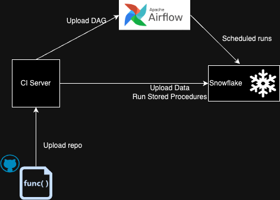
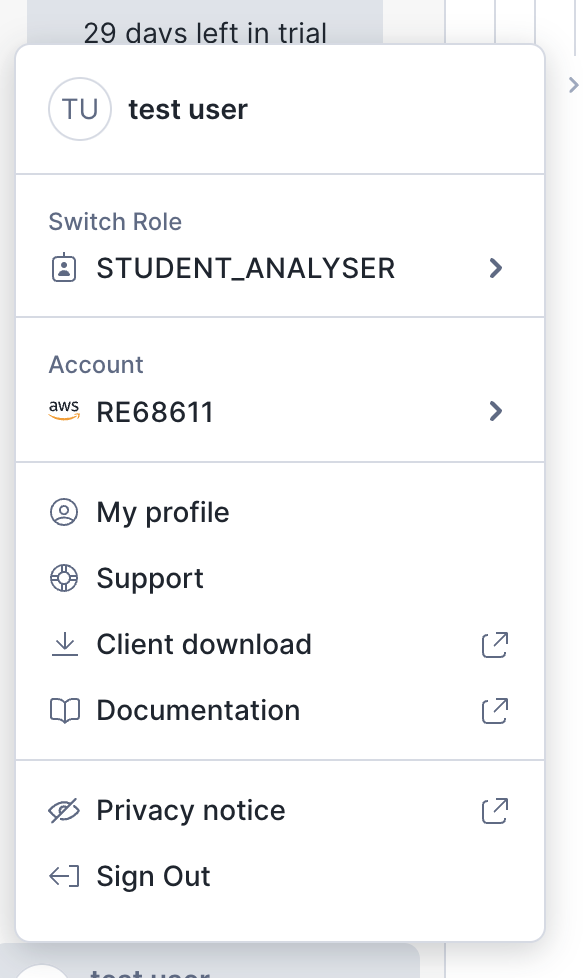
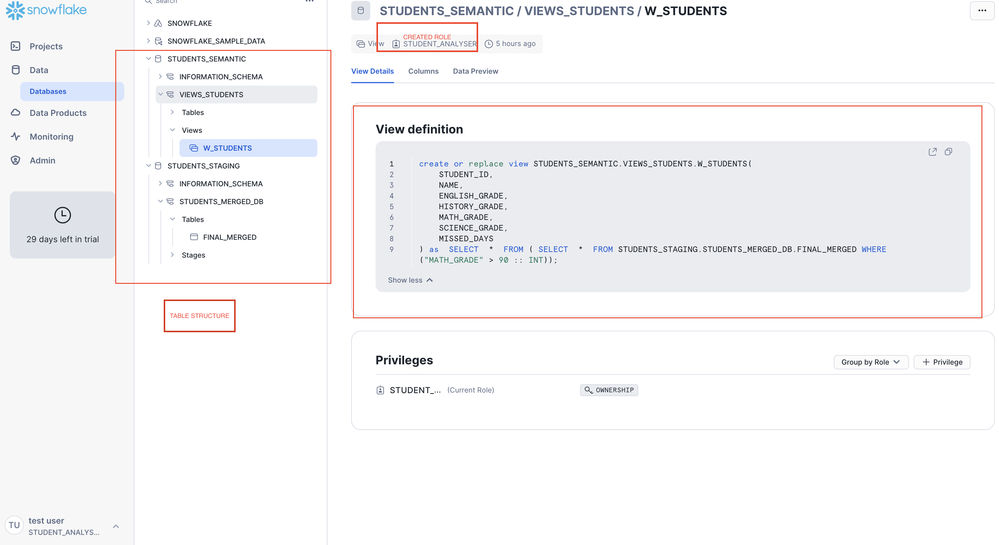
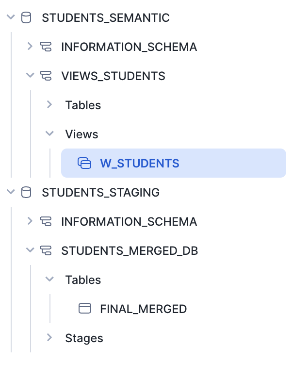
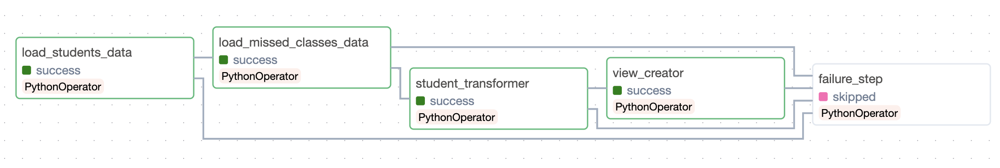
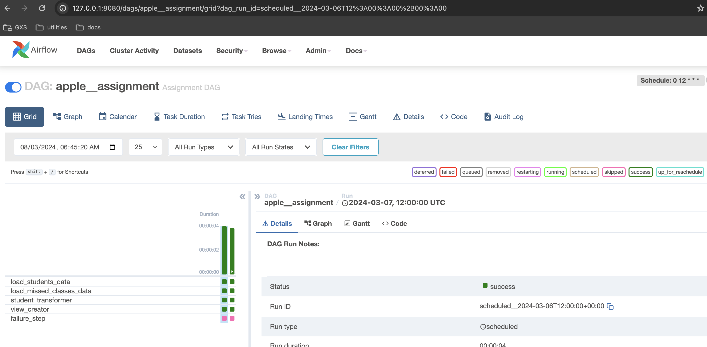
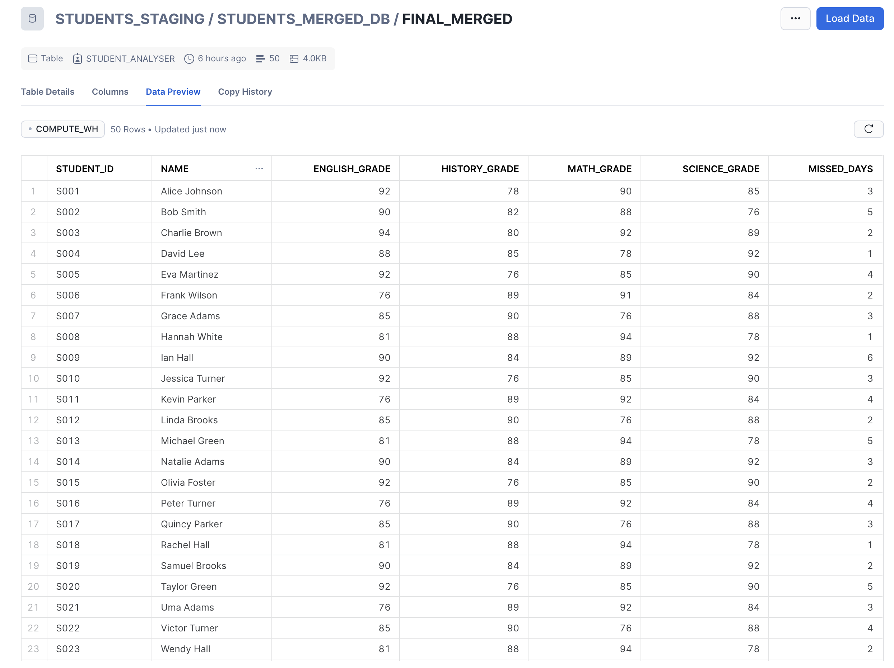
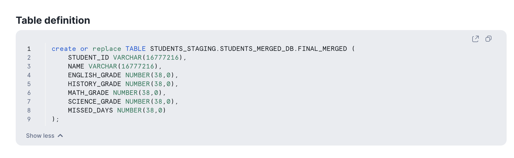
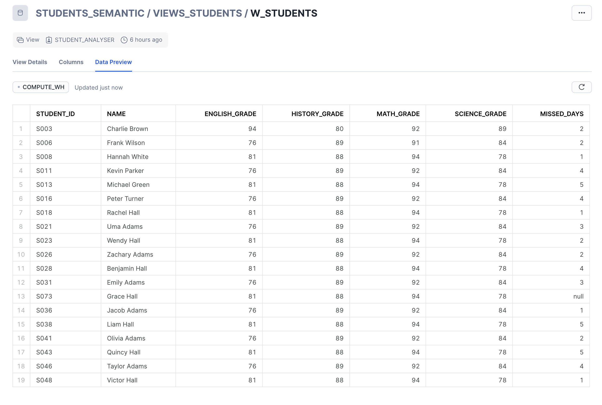

# Assessment

Ingesting Data in Snowflake with SnowSQL and Airflow



### Prerequisites

What things you need to install the software and how to install them

```
python 3.8
snowflake 8.9.2
snowflake-snowpark-python 1.13.0
snowsql client 1.2.32 [link](https://docs.snowflake.com/en/user-guide/snowsql-install-config)
airflow 2.8.1
docker 25.0.3
```

### Installing

Install [homebrew](https://brew.sh/)
Use homebrew to install python, followed by snowpark dependency using pip
Install docker, will be easy to bring airflow up, attached is the docker-compose.yaml and .env file for airflow
In order to run this in local, we can use scripts under [local_testing_scripts](local_testing_scripts), these scripts can be run independently as well.


## Idea

### Assumptions and callouts

 - This is a migration/ingestion task as said in mail
 - Snowflake since works in collaboration with a cloud service provider but due to a free account, I was able to only create stages in in snowflake else I would have liked to create the snowflake stage point to some cheaper storage option.


## Step 1 - Setting Up Snowflake

This is a one time activity, we only fiddle with this step when we want to onboard new ETLs or create new Users/Roles.

 - Free snowflake account creation. I have used a standard account with AWS as cloud provider.
 - Creating a user and role for user/airflow-job to connect to snowflake
    
 - Creating required schemas using SYSADMIN
 - Creating snowflake internal stages
 ```
    CREATE STAGE students_staging.students_merged_db.stage_student_data DIRECTORY = (ENABLE=TRUE);;
    CREATE STAGE STUDENTS_STAGING.STUDENTS_MERGED_DB.STAGE_SCRIPTS DIRECTORY = (ENABLE=TRUE);;
    CREATE STAGE STUDENTS_SEMANTIC.VIEWS_STUDENTS.VIEW_SCRIPTS DIRECTORY = (ENABLE=TRUE);;
 ```
 - Granting appropriate and only required permissions
 - Creating an event table for capturing logs
[account_setup_script](sql_scripts/account_setup_script.sql) is the script to be run post creation of Snowflake Account.



 - Also the repository contains a cleanup script
 - Permifrost is a good tool for role and access management in snowflake.

## Step 2 - Stored Procedures and Python Scripts Upload

Post our account and databases are sorted. We are ready to load data into our snowflake stage which we created in the earlier step already.
This will be the first task in the DAG.

- We will be creating 2 stored procedures, which will be called from airflow
1. [student_transformer.py](scripts/student_transformer.py) : This reads both the json data from `students_staging.students_merged_db.stage_student_data` which is a snowflake stage with directory enabled, joins them and writes to `STUDENTS_STAGING.STUDENTS_MERGED_DB.FINAL_MERGED`. Mode is `append`, first time it will create the table and write and from next run onwards it will append the data to the table.
2. [semantic_math_view.py](scripts/semantic_math_view.py) : This is a view which points to the table created above and filters for students having math grade > 90

- In order to load these two scripts as stored procedures in snowflake, we have used snowsql client. [snowsql.sh](sql_scripts/snowsql.sh)
We need to inject the environment variables before running this script. 
```
# Inject environment variables
export ACCOUNT_NAME=
export DB_NAME=
export SCHEMA_NAME=
export ROLE_NAME=
export WAREHOUSE=
export USERNAME=

snowsql \
  --accountname $ACCOUNT_NAME \
  --dbname $DB_NAME \
  --schemaname $SCHEMA_NAME \
  --rolename $ROLE_NAME \
  --warehouse $WAREHOUSE \
  --username $USERNAME \
  --query "PUT file:///${WORKING_DIR}/student_transformer.py @STUDENTS_STAGING.STUDENTS_MERGED_DB.STAGE_SCRIPTS/student_transformer AUTO_COMPRESS=FALSE OVERWRITE=TRUE
```

- These scripts can be viewed in snowsight. On top of these we run [stored_proc_creation.sql](sql_scripts/stored_proc_creation.sql), which registers these as stored procedures in snowflake
```
    CREATE OR REPLACE PROCEDURE STUDENTS_STAGING.STUDENTS_MERGED_DB.STAGE_SCRIPTS
    RETURNS string
    LANGUAGE python
    RUNTIME_VERSION = '3.8'
    PACKAGES = ('snowflake-snowpark-python')
    IMPORTS = ('@STUDENTS_STAGING.STUDENTS_MERGED_DB.STAGE_SCRIPTS/student_transformer/student_transformer.py')
    HANDLER = 'student_transformer.main'
    EXECUTE AS STUDENT_ANALYSER;


    CREATE OR REPLACE PROCEDURE STUDENTS_SEMANTIC.VIEWS_STUDENTS.VIEW_SCRIPTS
    RETURNS string
    LANGUAGE python
    RUNTIME_VERSION = '3.8'
    PACKAGES = ('snowflake-snowpark-python')
    IMPORTS = ('@STUDENTS_SEMANTIC.VIEWS_STUDENTS.VIEW_SCRIPTS/semantic_math_view/semantic_math_view.py')
    HANDLER = 'semantic_math_view.main'
    EXECUTE AS STUDENT_ANALYSER;
```

- This step should be mended in the CI process itself, and we can have the DDLs for stored procedures in the repo as well, any change in them will re-run the upload and stored proc will be recreated. 



## Step 3 - Airflow Orchestrator



I have tried to keep the DAG as clean as possible, there are 5 tasks in apple__assignment dag.
We are utilising Airflow Connections and Airflow Varibale to keep maintain the Snowflake Connection and save the user and password details.
- `load_data_in_stage` : This step loads the json data from local to Snowflake stage, which our transformer step is referring to. 
```
def load_data_in_stage(file_path, ):
    try:
        session = Session.builder.configs(connection_parameters).create()
        # Create stage if not exists.
        _ = session.sql(f"create stage if not exists {stage}.stage_student_data").collect()
        response = session.file.put(file_path, "@stage_student_data", auto_compress=False, overwrite=True)
        if response[0].status == 'UPLOADED':
            return
        else:
            logger.error(f'Data Upload Failed, {response[0].message}')
    except Exception as ex:
        logger.warn("Caught exception while uploading data to stage : ")
        logger.error(str(ex))
    finally:
        session.close()
```
This accepts a `file_path` parameter, hence runs twice to run once for each data file `students` and `missing_classes`
We verify in the end if the file has been uploaded successfully.

- `student_transformer`: For this we utilise the `SnowflakeOperator` and call the created stored procedure, which in turn populates the `FINAL_MERGED` table.
- `view_creator`: For this again we utilise the `SnowflakeOperator`
- `failure_step`: In case any of the task fails, this task gets executed to send out notifications in form of email/slack.




## Monitoring and Logging
This has been done at 2 levels :
1. We have used the evergreen logging library
2. We have used the in-build EVENT TABLE provided by snowflake. 


## Proposals
 - DBT
 - Permifrost

## Running the tests

Explain how to run the automated tests for this system

### And coding style tests

Explain what these tests test and why

```
python: [black](https://pypi.org/project/black/) 
sql: [sqlfluff](https://sqlfluff.com/)
```

## Deployment

2 ways in which this can be deployed is
- Dockerise -> Push Image to Artifactory -> Use the tag in Airflow and Run
- Upload repo to CI server -> Connect snowflake and push DDL changes -> Keep the DAG as it is 


## Versioning

We can use [SemVer](http://semver.org/) for versioning. For the versions available, see the [tags on this repository](https://github.com/your/project/tags). 

## Authors

## License

## Project Images





## References

* [Event Table](https://docs.snowflake.com/en/sql-reference/sql/create-event-table)
* [SnowPark](https://docs.snowflake.com/en/developer)
* [Permifrost](https://medium.com/yousign-engineering-product/snowflake-rbac-implementation-with-permifrost-3d30652825ad)
* [SnowSQL](https://docs.snowflake.com/en/user-guide/snowsql)
* [Inovex Blog](https://www.inovex.de/de/blog/orchestrating-snowpark-scripts-with-apache-airflow/)
* [SnowflakeOperator](https://airflow.apache.org/docs/apache-airflow-providers-snowflake/stable/operators/snowflake.html)